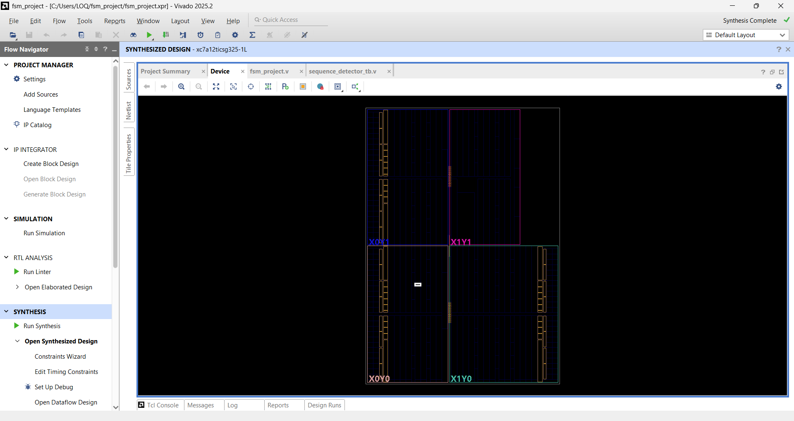
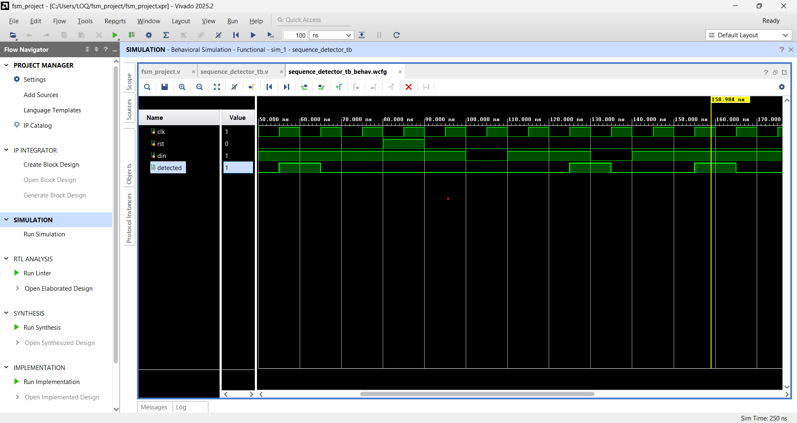

# Verilog FSM Sequence Detector

Designed and verified an overlapping 1011 sequence detector using Moore FSM architecture in Verilog HDL.

---

## Overview

This project implements an **Overlapping 1011 Sequence Detector** using a **Moore Finite State Machine (FSM)** in Verilog HDL. The design continuously monitors a serial input stream and asserts the output whenever the target sequence **1011** is detected.

The detector supports **overlapping sequence detection**, enabling consecutive occurrences of the pattern to be recognized without resetting the FSM. This project demonstrates key RTL design principles including state machine design, sequential logic implementation, combinational next-state logic, and functional verification.

---

## Project Objectives

- Design a Moore FSM using Verilog HDL
- Detect the sequence **1011** in a serial data stream
- Support overlapping pattern detection
- Develop and verify the design using a dedicated testbench
- Generate synthesizable RTL suitable for FPGA and ASIC design flows

---

## Key Features

- Moore FSM Architecture
- Overlapping Sequence Detection
- Synthesizable RTL Design
- Functional Verification Using Testbench
- RTL Schematic Generation
- Simulation Waveform Analysis
- FPGA/ASIC Design Flow Compatible

---

## Sequence Detection

### Target Pattern

```text
1011
```

### Example

| Input Stream | Detection Result |
|-------------|------------------|
| 1011 | Sequence Detected |
| 1011011 | Two Detections |
| 1001 | No Detection |

---

## FSM States

| State | Description |
|---------|-------------|
| S0 | Initial State |
| S1 | Detected '1' |
| S2 | Detected '10' |
| S3 | Detected '101' |
| S4 | Detected '1011' (Detection State) |

---

## State Transition Flow

```text
S0 --1--> S1
S0 --0--> S0

S1 --0--> S2
S1 --1--> S1

S2 --1--> S3
S2 --0--> S0

S3 --1--> S4
S3 --0--> S2

S4 --1--> S1
S4 --0--> S2
```

---

## RTL Design

The design consists of:

- State Register Logic
- Next-State Logic
- Output Logic
- Reset Logic
- Overlapping Detection Support

The RTL is written using synthesizable Verilog constructs and can be integrated into FPGA or ASIC design flows.

---

## Verification

A dedicated Verilog testbench was developed to validate the functionality of the FSM.

### Test Case 1 – Valid Sequence

Input:
```text
1011
```

Expected Result:
```text
Sequence Detected
```

### Test Case 2 – Overlapping Detection

Input:
```text
1011011
```

Expected Result:
```text
Two Successful Detections
```

### Test Case 3 – Invalid Sequence

Input:
```text
1001
```

Expected Result:
```text
No Detection
```

---

## Project Files

| File | Description |
|--------|-------------|
| sequence_detector.v | RTL implementation of the FSM |
| sequence_detector_tb.v | Functional verification testbench |
| sequence_detector_waveform.png | Simulation waveform output |
| sequence_detector_rtl_schematic.png | Synthesized RTL schematic |
| README.md | Project documentation |

---

## RTL Schematic



---

## Simulation Waveform



---

## Tools Used

- Verilog HDL
- AMD Vivado 2025.2
- Vivado Simulator
- RTL Analysis
- Synthesis

---

## Skills Demonstrated

- Verilog HDL
- RTL Design
- Finite State Machine (FSM) Design
- Digital Logic Design
- Functional Verification
- Simulation and Debugging
- FPGA Design Flow
- ASIC Design Fundamentals

---

## Future Enhancements

- Mealy FSM Implementation
- Parameterized Sequence Detector
- SystemVerilog Assertions (SVA)
- Functional Coverage
- FPGA Hardware Validation
- UVM-Based Verification Environment

---

## Author

**Rahul Ingale**

B.Tech Electronics & Telecommunication Engineering

Aspiring RTL / ASIC Design Engineer

### Skills
Verilog HDL • RTL Design • FSM Design • Digital Logic • VLSI
